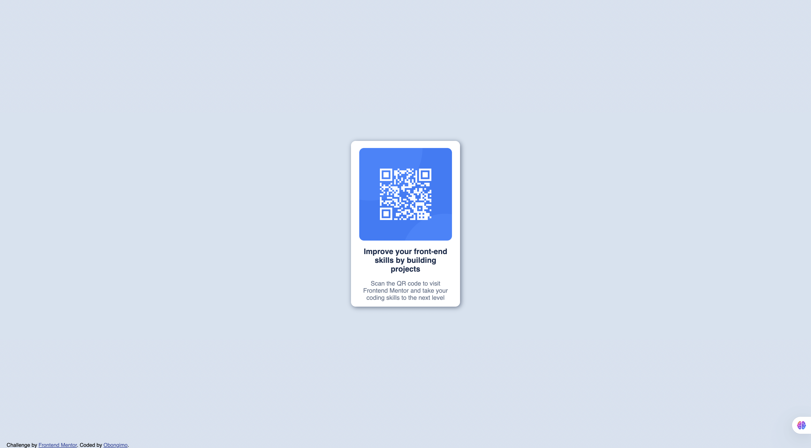

# Frontend Mentor - QR code component solution

This is a solution to the [QR code component challenge on Frontend Mentor](https://www.frontendmentor.io/challenges/qr-code-component-iux_sIO_H). Frontend Mentor challenges help you improve your coding skills by building realistic projects. 

## Table of contents

- [Overview](#overview)
  - [Screenshot](#screenshot)
  - [Links](#links)
- [My process](#my-process)
  - [Built with](#built-with)
  - [What I learned](#what-i-learned)
  - [Continued development](#continued-development)
  - [Useful resources](#useful-resources)
- [Author](#author)

## Overview

### Screenshot

### Links

- Solution URL: https://github.com/obongimo-FE/qr-code
- Live Site URL: https://qr-code-mu-rosy.vercel.app/

## My process

### Built with

- Basic HTML5 elements
- Basic CSS styling
- Mobile-first workflow

### What I learned

I learnt with the right focus and determination, I can accomplish it all!

### Continued development

I would like to make the site more alive, by make it a qr-code generator for all this and everyone. Yes, I know it already exist!

### Useful resources

- [w3schools](https://www.example.com) - Both of them goes without saying!
- [MDN](https://www.example.com) 

## Author

- Frontend Mentor - [@obongimo](https://www.frontendmentor.io/profile/obongimo)
- Twitter - [@obongimo](https://www.x.com/obongimo)
